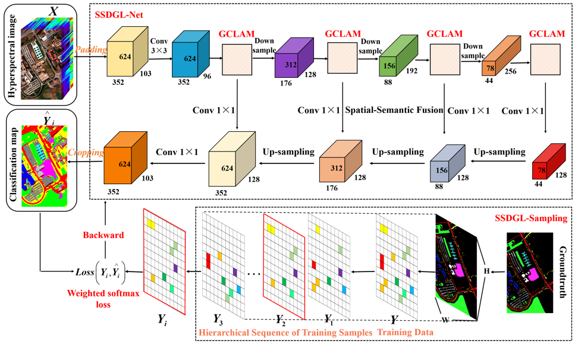
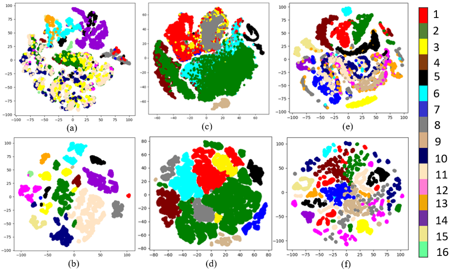

# A Spectral-Spatial Dependent Global Learning Framework for Insufficient and Imbalanced Hyperspectral Image Classification

Pytorch implementation of our method for hyperspectral image classification.






## Citation
+ If you extend or use this work, please cite the paper where it was introduced:
```
@ARTICLE{9440852,
  author={Zhu, Qiqi and Deng, Weihuan and Zheng, Zhuo and Zhong, Yanfei and Guan, Qingfeng and Lin, Weihua and Zhang, Liangpei and Li, Deren},
  journal={IEEE Transactions on Cybernetics}, 
  title={A Spectral-Spatial-Dependent Global Learning Framework for Insufficient and Imbalanced Hyperspectral Image Classification}, 
  year={2021},
  volume={},
  number={},
  pages={1-15},
  doi={10.1109/TCYB.2021.3070577}}
```
+ Q. Zhu, W. Deng, Z. Zheng, Y. Zhong, Q. Guan, W. Lin, L. Zhang, and D. Li, 
“A Spectral-Spatial-Dependent Global Learning Framework for Insufficient and Imbalanced Hyperspectral Image Classification”, 
IEEE Trans. Cybern., DOI:10.1109/TCYB.2021.3070577.
+ You can contact the e-mail dengweihuan@cug.edu.cn if you have further questions about the usage of codes and datasets.

## Installation
  
* Clone this repo.
```
git clone https://github.com/dengweihuan/SSDGL
```


